## OSboxes kya hota he ?
osboxes me virtual machine images hoti heen.

### How we use osboxes?

osboxes ko istemal karne ke liye aapko pehle virtualization software (jaise ke Oracle VirtualBox ya VMware Workstation) ki zaroorat hoti hai.

### why osboxes used?

1. Waqt Ki Bachat
2. Security
 
. Ek naya OS (jaisa ke Ubuntu ya centOS) install karne mein kaafi waqt lagta hai. osboxes ke images ko download karke aap seconds mein VM shuru kar sakte hain.

.  Asal system ko nuksan pahunchaye baghair, aap naye  OS bna skte hain.
### What is Linux ?
___
Linux is a open source **kernal** base OS .Kernal is core component of a OS.

```Linux  powerful, secure, stable system (servers, devops, cyber security, programming).```
### Who Created Linux?
#### Linux developed by Linus torvalds. He born in Finland.

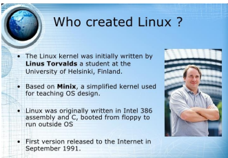
 ___
 ### Why Linux?

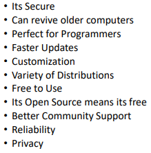

* Linux kernel open-source hai Yani koi bhi modify, customize,kar sakta hai (server companies, cloud providers, Android OS tak Linux kernel pe chal hain).

* Linux servers aur production environment me zyada stable aur fast mana jata hai.

* Resource usage kam hota hai (RAM/CPU kam consume karta hai).

* Long uptime possible (servers months/years restart kiye bina chal sakte hain).

 ```JB K```_**Windows**_ comparatively heavy hai aur updates me forced reboots zyada aate hain.

Har koi apna Linux Distro bna skta heen

___
#### Deffirence Between Linux & Other Os (Window)
___
* visual chart

 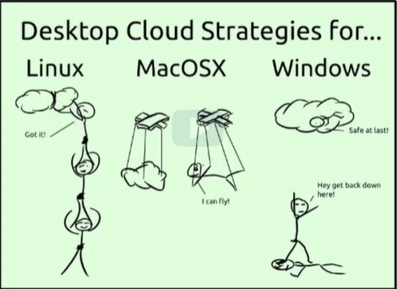

 ss.from Leacture
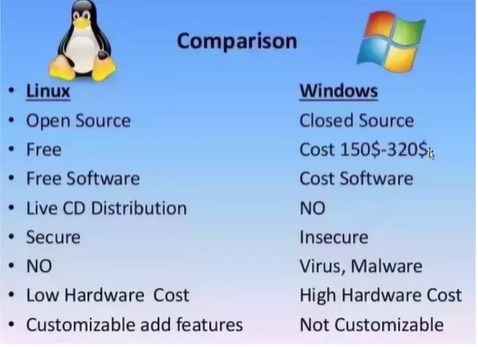

Linux | Window
---------|----------
 Ye open source OS hee | ye closed Source hee 
 Totaly free of cost | Licences buy krny hote hee
 Customizeable hee| non customize able hee(yani koi changing ni kr sktee)
___

### Importance of Linux


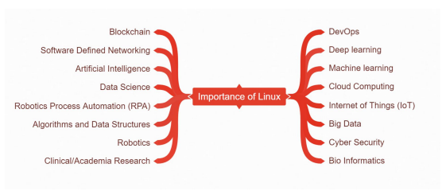
___
### Linux Shell

```Shell ek program hai jo user ki commands ko Operating System tak pohchata hai aur phir uska result user ko dikhata hai. Matlab shell ek interface hai jo user aur OS ke darmiyan hota hai.```

**Jeesy k 1 Urdu or arabic k drmyaan translater kaam krta ee to un ko baat smjh mee ati he is trha shell user ki commands ko OS ki feham commands mee deta hee to OS hmaari baat smjh kr act krta he or OS hardware ko run krta he .**

Linux mein bohot se command-line shells available hain jaise:

- sh shell

- zsh shell

- c shell

- Sb see imortant shell _**Bash Shell**_ he .

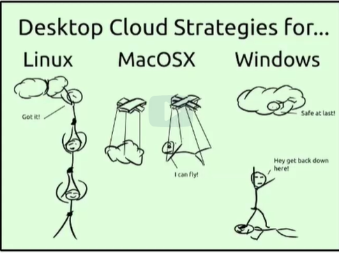

### SS. ki wzahat :

- Linux me users khud 1 doosry ko helpout krte hoye cloud tk punchtee hee.

- MacOSX  apna luxury system deta hai (controlled but smooth).

- Windows  Restrictions aur limitations ki wajah se users ko rok leta hai.

### Files & Directories
| Directory | dir ka kaam |
|-----------|----------------------------|
| **/bin**  | Basic commands (ls, cp, mv) |
| **/boot** | Booting files (kernel, grub) |
| **/dev**  | Devices (USB, HDD, etc.) |
| **/etc**  | System config files |
| **/home** | Users ka personal data |
| **/lib**  | Libraries & kernel modules |
| **/media**| USB/CD mount hota hai |
| **/mnt**  | Temporary mount point |
| **/opt**  | Extra installed software |
| **/sbin** | Admin commands (reboot, shutdown) |
| **/srv**  | Services ka data (web/ftp) |
| **/tmp**  | Temporary files (restart pe delete) |
| **/usr**  | User programs & tools |
| **/var**  | Logs, cache, mail (changing data) |
| **/root** | Root user ka home |
| **/proc** | Processes & system info (virtual) |


*  /bin
   * /bin ka main kaam hai system ke basic operations ke liye zaroori commands provide karna, taake har user (root ya normal) unhe use kar sake.
  
Jese k (ls,cp,mv etc)

* tar

    * ye zip files ko extract krny k lye use hoti .
  
* /etc

  * ye ek configuration directory hai.Isme system-wide configuration files aur startup scripts hote hain.
  *  **configuration** files kisi system, software ya device ki settings aur rules jo usko batate hain ke kaise kaam karna hai.
  
    * agar hum nee koi user add krna he ya koi group bnana ho to ye directory use krtr heen.

* /home

  * is directory mee desktop k documents pics vgera milty hee. isy user ka ghar kehty hee .
* file ko delete krna

   * agr kisi file ko ya directory ko remove yani delete krna ho to ```rm -rf`` command use krte hee.

* file copy krna 

##### is leacture me jin commands k baary me prhaa he>
- How to copy files
- How to move files
- How to delete files
- How to zip & unzip files

### Wildcards ka concept.

wildcards shortcuts hote heen jo files/directories ka names match krte heen.

Jab aapko exact file ka naam likhna mushkil ho (ya bohot sari files ek jaisi ho), to aap wildcard symbols use karke ek sath kaam kar sakte ho.

wildcards symbols.

Wildcards ke common symbols → * , ? , [ ] , [! ] , { }

- sub se powerful symbolnn*he 
___

## Linux Users types


There are 2 types of users.

- standard user
- root user

| Kaam | Standard User | Root User |
|------|---------------|-----------|
| Software install | Nahi kar sakta | Kar sakta hai (`sudo yum install`) |
| System files edit | Nahi kar sakta | Kar sakta hai (`/etc/` me edit) |
| User add/delete | Nahi kar sakta | Kar sakta hai (`useradd`, `userdel`) |
| Apni files manage | Kar sakta hai | Kar sakta hai (sabki files bhi) |
| System reboot | Nahi kar sakta | Kar sakta hai (`reboot`) |

- How to add a user?
 
 ``` adduser yasir```

   proper caption ka sath command

 ``` useradd -c "ghulam yasir" -m -s "bin/bash" yasir```

- How to delete a user?

userdel likh kr jo user delete krna he us ka name likh deen.

 ``` userdel yasir```

 - How to lock a user?

 ```usermod ``` command ko user kr  k -L k saath jis user ki access ko lock krna he is ka name deen.

 ``` usermod -L yasir```
 
 - How to unlock a user access?

```usermod ``` command ko user kr  k -u k saath jis user ki access ko lock krna he is ka name deen.

 ``` usermod -u yasir```

 - How to chamge a name of user name?

``` usermod -c "Abdullah" yasir```

yani usermod ki command -c k saath likh kr jo naya name rkhna he wo likh deen or jis user ka name change krna he wo likh dee. 

 is se user ka display name change ho ga na k original name .
___
## Diffrence between" su "  and "sudo"

Major Difference
- su (switch user)

 aapko root ka password chahiye hota hai, aur uske baad aap pure root ban jaate ho jab tak exit na karo.

- sudo (super user do)

    - aap apna khud ka password dete ho, aur sirf ek command root ke powers se chalti hai.

 _**gar aap sudo -i ya sudo su - chalaya**_ 
 
  to aap root shell mein aa jaate ho aur phir jitni marzi commands run karoge wo root hi hongi (tab tak exit na karo).

```Example: sudo -i → ab whoami karein to root aayega.```

_**Sudo credential caching**_ 

jab aap pehli baar sudo chalate ho to password poocha jata hai. Uske baad kuch minutes (default ~15 min) tak sudo password dubara nai poochega — lekin phir bhi aapko har command ke aage sudo lagani padegi. Nahi to command normal user rights se chalegi.

matlab sudo hacommand k saath likhna ho gaa 

---

## Ownership of files and directories in linux
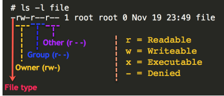


- How to change ownership of a file?
  
  - ```chown``` command dee oe jis user ko owner ship deni he us ka name likh kr file ka path dee or run kr dee

  - ``` chown username filename ```
- changing without root user
    - ```sudo chown -R username filename```

- How to change ownership of a group?

  ```chgrp```
  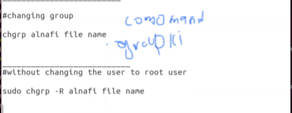

___

## Files prmissions 

### rwx ka concept 
Ye file permissions ko represent karta hai (Unix/Linux mein). Har file/directory ke liye 3 tarah ke permissions hoti hee.

 1. r → read 

 2. w → write (modify karna)

3. x → execute (chalana )

Aur ye permissions 3 trha k users ke liye  kiye jaate hain.

1. Owner (u – user) jisne file banayi.

2. Group (g) jo log us group mein hain.

3. Others (o) system ke baqi sab users
   
   #### owner zyada tar ```rwx ```premission rkhta he yani wo file ko read bhi kr skta he .file contenr ko modify bhi kr skta he ,or file ko chla bhi skta he .


- permissin deny ki comands
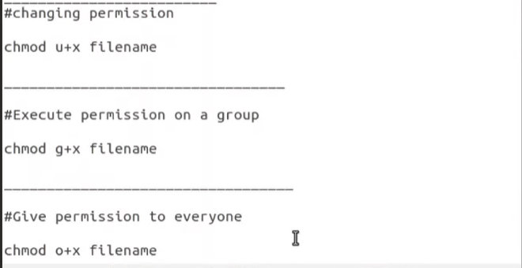

- permision wapis leny ki comands
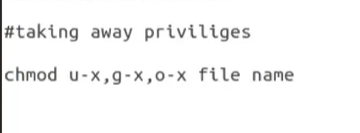

## Files ka size check krny k lye commands
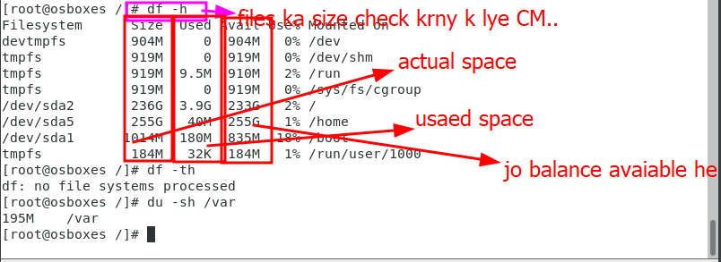

# Networking Basics

### what is ns lookup?


nslookup ek DNS testing aur troubleshooting tool hai jo mostly network admins, DevOps aur Cyber Security walay use karte hain to check domain/IP mapping, mail servers, aur DNS errors.

### What is DNS?
DNS ek system / service hai jo domain names (jaise google.com) ko IP addresses (jaise 142.250.185.110) me convert karta hai.

Koi bhi website ya pakage hum internet pee search krte hee to hum name see saerch krtee hee lekin servers in ko ip see janty ee na k by name DNS un webs ka ip servers ko provide krta he to website open hoti hee.

- DNS ki record types
  
  - DNS ke bahut types ke records hain, lekin tumhare liye practical level pe 8–10 records sabse zyada important hain (especially A, AAAA, MX, TXT, ).
  
- DNS Record Types

| Record    | Full Form           | Kaam (Purpose)                                                            |
| --------- | ------------------- | ------------------------------------------------------------------------- |
| **A**     | Address Record      | Domain ko **IPv4 address** se map karta hai.                              |
| **AAAA**  | IPv6 Address Record | Domain ko **IPv6 address** se map karta hai.                              |        |
| **MX**    | Mail Exchange       | Mail servers specify karta hai (email routing).  

## what is vm ware ?

VMware 1 company hai jo virtualization software banati hai yani Hypervisor.

app is software ki madad see apny comupte par a virtual machine bns skte he or wo computer ki trha hi kam kry gi.
 assan alfaz mee aap aik computer ke andar aik aur computer bna sktee hai. 

### what is Hypervisor?
 Hypervisor physical computer aur virtual machines ke operating systems ke darmiyan aik layer ki tarah kaam karta hai. Hypervisor host ke resources, jaise ke CPU, memory, aur storage ko har VM ke liye manage aur allocate karta hai.

## importance of VMs?

- VMs ko aasani se backup, move, aur restore kiya ja sakta hai, jisse disaster recovery a zyada behtar hoti hai.
- Har VM dosri se alag hoti hai, jisse security barhti hai. Agar aik VM ko nuqsan pohnche to dosri mehfooz rehti hai.
- VMs ko aik physical server se dosre par aasani se move kiya ja sakta hai, chahe hardware alag bhi ho.
- Aap aik hi physical server par kai virtual servers chala sakte hain. Yani ye multi user , multi taska hoti he.
- 

## Working with Files/Directories

- ye sb topics laredy hum prh chuky hee kuch or bsics add krte hee.

  - File/directory create krnan (touch / mkdir)

  - Files ko copy krna (cp)

  - Files kon delte krna (rm)

  - Files ko move krna (mv)
 etc....

 ### Linux File Commands:

 
 - Simple Concept
    - File ko **overwrite** karna hai ya **bachana** hai?  
    - User se **puchhna** hai ya **bina puchhe** kar dena hai?  
    - Old file ko **rename** karna hai ya **delete** karna hai?  
    - Copy/move ki **details dikhani** hain ya **chupana** hai?  
  ## variable paths

  - variable paths ka concept 
  
    - variable paths se muraad aisi directories (folders) ya files hain jin ka location ya naam badalta rehta hai.
  
### variable paths ko dekhe ka kia treeqa kar

variable paths different types k heen.

- enviroment varibales 
- local veriables

variables ko deekhny k lye ```echo``` ki command use hoti hee.

### Processes

- Process woh qadmon ka aik mazboot aur munazzam (organized) silsila hai jo kisi khaas maqsad ko poora karne ke liye, maujooda resources ko istemaal karte hue, input ko output mein tabdeel karta hai.


  - ps	System mein maujood processes ki ek snapshot (static list) dikhata hai.

  - top	Real-time mein running processes aur unke CPU/Memory usage ko continuously dikhata hai.

  - htop	top se zyada user-friendly aur interactive version.
 
  - kill	Kisi process ko uske PID ke zariye band karne ya signal bhejne ke liye.

  - bg/fg	Processes ko Background (pichhe) aur Foreground (aage) mein bhej kar unhe control karna.
